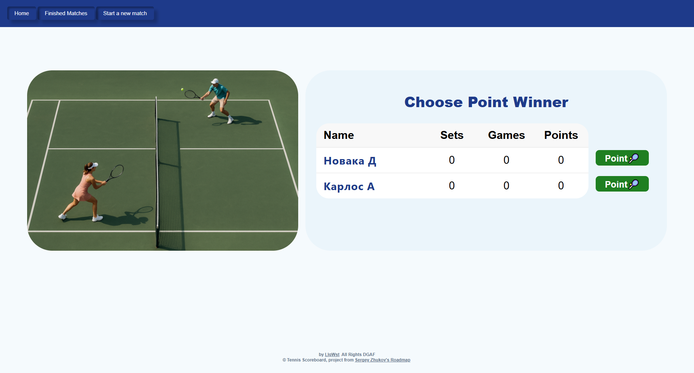

# Табло теннисного матча

Веб-приложение, реализующее табло счёта теннисного матча.

## Мотивация проекта

Изучить MVCS, Hibernate, H2, HTML, CSS.

## Стек
- Java 17.0.15
- Tomcat 10.1.41
- Apache Maven 3.9.9
- H2:mem 2.3.232
- Junit5 5.13.4

## Структура Базы данных

## Функционал приложения
### Работа с матчами:

- Создание нового матча
- Просмотр законченных матчей, поиск матчей по именам игроков
- Подсчёт очков в текущем матче

### Подсчёт очков в теннисном матче

Каждый матч играется по следующим правилам:
- Матч играется до двух сетов (best of 3)
- При счёте 6/6 в сете, играется тай-брейк до 7 очков

## Интерфейс приложения

### Главная страниц - /
- Ссылки, ведущие на страницы нового матча и списка завершенных матчей

### Страница нового матча - /new-match
- Форма с полями “Имя игрока 1”, “Имя игрока 2” и кнопкой “старт”.

### Страница счёта матча /match-score

#### Интерфейс:

- Таблица с именами игроков, текущий счёт
- Формы и кнопки для действий - какой игрок получил поинт
- Нажатие кнопок приводит к POST запросу по адресу /match-score?uuid=$match_id, в полях отправленной формы содержится айди выигравшего очко игрока

### Страница сыгранных матчей - /matches

Постранично отображает список сыгранных матчей. Позволяет искать матчи игрока по его имени.

#### Интерфейс:

- Форма с фильтром по имени игрока. Поле ввода для имени и кнопка “искать”. По нажатию формируется GET запрос вида /matches?filter_by_player_name=${NAME}
- Список найденных матчей
- Переключатель страниц, если матчей найдено больше, чем влезает на одну страницу

## Запуск программы

- git clone https://github.com/LlqWst/TennisScoreboard.git
- добавить при запуске Tomcat 2 переменные окружения: 
  - USER_DB
  - PASS_DB
- порты 8083, 9093 должны быть свободны для web интерфейса H2
- Запустить Tomcat